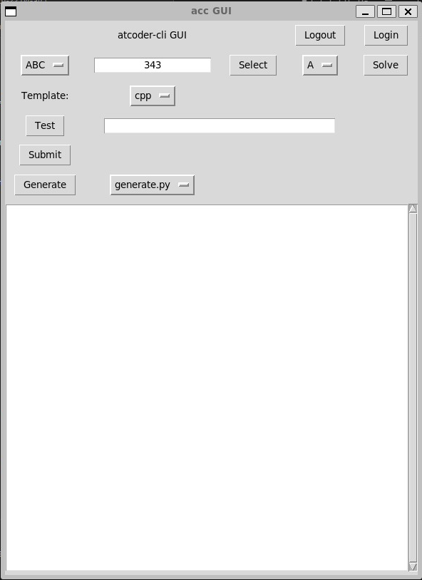

# AtCoder GUI
## 環境
* Python3.10 or newer

Tkinterを使用しています。インストールされていない場合は[こちら](#tkinterがない)をご覧ください。
## 説明
[AtCoder-GUI](https://github.com/TsuruNoTsurugi/atcoder-gui)は[AtCoder-CLI](https://github.com/Tatamo/atcoder-cli)の機能をPython tkinterを用いてGUI化し、操作パネルのようにして、コマンド操作を不要としました。


## インストール
まず、[AtCoder CLI チュートリアル](http://tatamo.81.la/blog/2018/12/07/atcoder-cli-tutorial/)の`テンプレート設定`までを完了させてください。
PythonとC++を同時に使う場合は、`template.json`ファイルは以下のようにすると便利です。

```json:template.json
{
  "task":{
    "program": ["main.cpp","main.py"],
    "submit": "main.cpp"
  }
}
```

* このレポジトリをいつも問題を解くディレクトリ(問題ごとのディレクトリがあるディレクトリ)に設置してください。ディレクトリツリーは以下のようになります。

```text
<BASE ROOT PATH>
├── .config
│   └── atcoder-cli-nodejs
│       ├── config.json
│       ├── cpp
│       │   ├── main.cpp
│       │   ├── main.py
│       │   └── template.json
│       ├── py
│       │   ├── main.cpp
│       │   ├── main.py
│       │   └── template.json
│       └── session.json
├── abc340
│   ├── a
│   │   ├── main.cpp
│   │   ├── main.py
│   │   └── tests
│   │       ├── sample-1.in
│   │       ├── sample-1.out
│   │       ├── sample-2.in
│   ...     └── sample-2.out
│ ...
├── ac-library
├── acc-login.sh
└── gui
    ├── config.py
    ├── main.py
    ├── python_test.sh
    └── shell_communication.py
```
* `config.py`の`# TODO`とある部分を設定してください。

```python:config.py
USER_NAME = "<Your User Name>"  # TODO
PASSWORD = "<Your Password>"    # TODO
ATCODER_BASE_URL = "https://atcoder.jp"
CONTEST_TYPE_LIST = ["ABC","ARC","AGC"]
CONTEST_PROB_LIST = ["A","B","C","D","E","F","G"]
TEMPLATE_TYPE_LIST = ["generate.py"]
BASE_ROOT_PATH = "<Your Base User's Path>"  # TODO
PYTHON_SHELL_FILEPATH = "<BASE ROOT PATH>/gui/python_test.sh" # TODO
LANGUAGE_LIST = ["cpp","py"]
LANGUAGE_NUM_LIST = [5028,5055]
NORM_LANGUAGE = 0
```

* コマンドラインから以下のコマンドを入力するとGUI画面が現れます。
```bash
$ python3 gui/main.py
```

## 使い方
[ABC339-A](http://atcoder.jp/contests/abc339/tasks/abc339_a)をC++で解く例として解説します。
### ログインする
ログインボタンを押すだけ。
もし、平文でユーザー名、パスワードを保存したくない場合は`acc login`でセッションを取得してください。
### 問題を設定する
* まず、以下のコマンドでユーザーを標準ユーザーにします。
```bash
$ su <標準ユーザー名>
```
* 以下のコマンドでGUI画面を呼び出します。
```bash
$ python3 gui/main.py
```
* すると以下のような画面が出るので、解くコンテスト名(例:ABC339)などを入力して、`Select`を押してください。この操作は以下のコマンドと同じです。
  

```bash
$ acc new abc339
```
* 次に解く問題を決めます。`Select`の横にある`Solve`を押すと、`Submit`の横にあるURLが変わります。例えば、ABC339-AをとくとURLは以下のようになります。


* ソースコードを書いてください。

### ソースコードをテストする
* 書いたソースコードのファイル名を`Test`の横のボックスに入力してください。ここで、ソースコード`main.cpp`のフルパスは以下のように認識されます。
```
<BASE ROOT PATH>/abc339/a/main.cpp
```
* `Test`ボタンを押してソースコードをテストしてください。テスト結果の総合は`Test`の行に表示されます。詳細は別ウィンドウで表示されます。

### template-generatorを使用する
[online-judge-template-generator](https://github.com/online-judge-tools/template-generator)を使用することができます。template-generatorについては、[GitHubのページ](https://github.com/online-judge-tools/template-generator)から確認してください。
* `Generate`ボタンで`template`を生成することができます。

### ソースコードを提出する
`Submit`ボタンでソースコードを提出できます。提出時、標準で以下のタイプを行っています。
```
Are you sure? Please type "abca"
```
慎重にソースコードを提出したいなどこの入力をやめたい場合は、`gui/main.py`の42行目をコメントアウトしてください。
```python:main.py
# main.py:line:42
proc.stdin.write(f"abc{pb.lower()}\n".encode())
		↓
#proc.stdin.write(f"abc{pb.lower()}\n".encode())
```

## WSLでGUI画面が出ない
WSLを使っている場合は、標準でGUI画面を出力することができません。以下のツールを使い、Windows側にサーバーを立てることで対応してください。
* [VCXSRC | sourceforge](https://sourceforge.net/projects/vcxsrv/)

## Tkinterがない
以下をお試しください。
```bash
$ apt-get install python3-tk
```

## 内部で使用しているコマンド
感謝
* [AtCoder-cli](https://github.com/Tatamo/atcoder-cli)
* [online-judge](https://github.com/online-judge-tools/oj)
* [online-judge-template-generator](https://github.com/online-judge-tools/template-generator) (optional)
